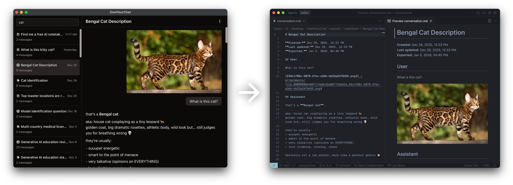

# OwnYourChat

One app to sync all your AI chats — ChatGPT, Claude, Perplexity — into a local database you own.

Your data is scattered across multiple silos, each one hoping you'll never leave. OwnYourChat syncs them all into a local SQLite database you control. Open source. Extensible. Local-first.

## Why?

AI conversations are locked in corporate silos. You can't search across providers. You can't share context between them. When you're in Claude, it doesn't know what you researched in Perplexity yesterday.

We pay for these tools. We give them our data. And we get no practical way to access our own conversations together.

OwnYourChat is the fix. Think **Obsidian, but for AI chats** — open, hackable, and yours.

## Features

- **🔄 Automatic Sync** — Syncs conversations from ChatGPT, Claude, and Perplexity to a local SQLite database
- **🔍 Search & Browse** — Search across all conversations and browse your chat history
- **🌳 Branch Navigation** — Navigate through conversation branches (for chats with multiple response variations)
- **📤 Export** — Export conversations to JSON or Markdown format
- **💾 Offline Access** — Access all synced conversations without an internet connection
- **🖼️ Attachment Support** — Preserves images and files from conversations
- **🤖 MCP Server** — Expose your chats to AI assistants via [Model Context Protocol](https://modelcontextprotocol.io)

## MCP Integration

OwnYourChat includes a built-in MCP server that lets AI assistants (like Claude in Cursor) search and read your synced conversations. Available tools:

- `list_conversations` — List all synced conversations
- `get_conversation_with_messages` — Get a specific conversation with full message history
- `search_conversations` — Search conversations by keywords in titles
- `search_messages` — Search messages by keywords in content

Enable the MCP server from Settings in the app.

## Roadmap

**Coming soon:**

- [ ] Gemini support
- [ ] Grok support

**Future vision:**

- [ ] Plugin system — build and share extensions
- [ ] Cross-provider context — continue any chat with any model
- [ ] Native chat UI with BYOK (Bring Your Own API Keys)
- [ ] Voice mode
- [ ] Shared memory layer across all your AI chats

## Installation

There are no downloadable builds available yet. Sign up for the waitlist at [ownyour.chat](https://ownyour.chat) to be notified when builds are ready.

To use the app now, clone the repository and run it locally:

```bash
git clone https://github.com/mlshv/ownyourchat.git
cd ownyourchat
pnpm install
pnpm dev
```

## Development

Run tests:

```bash
pnpm test
```

Type checking:

```bash
pnpm typecheck
```

## Building

```bash
# For macOS
pnpm build:mac

# For Windows
pnpm build:win

# For Linux
pnpm build:linux
```

## Database Management

Open Drizzle Studio to inspect the database:

```bash
pnpm db:studio
```

## Principles

- **Local-first** — Your data stays on your machine
- **No data collection** — We don't collect user data
- **No paywalls on essentials** — Core functionality is free
- **Open source** — Inspect, modify, contribute

## Links

- 🌐 Website: [ownyour.chat](https://ownyour.chat)
- 🐦 Twitter: [@ownyourchat](https://twitter.com/ownyourchat)
- 💻 GitHub: [github.com/mlshv/ownyourchat](https://github.com/mlshv/ownyourchat)

## License

MIT

## Author

Misha Malyshev
